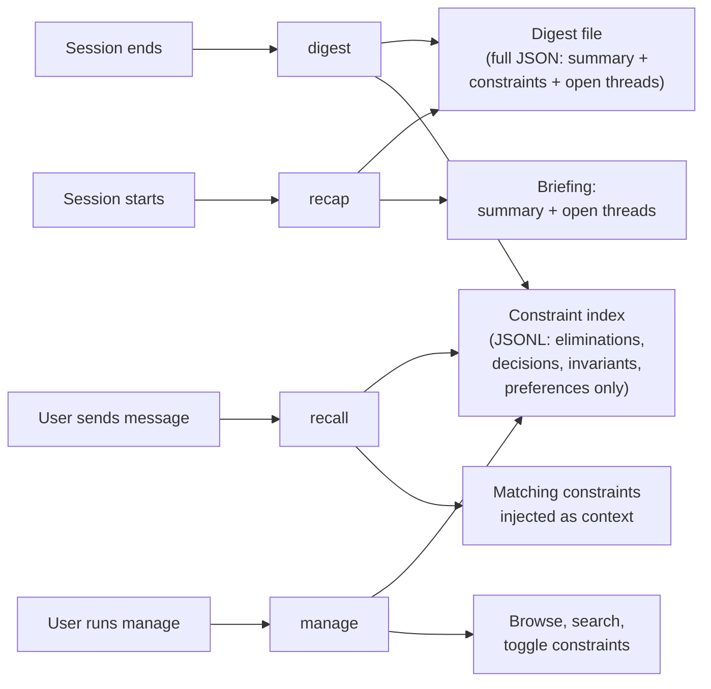

# harness-mem

A CLI tool that analyzes AI agent session logs and extracts structured, reusable constraints. Hooks into Claude Code's session lifecycle to automatically capture what happened in each session, surface relevant context mid-conversation, and brief you when you return.

[](https://npmjs.org/package/harness-mem)

## The Problem

Coming back to agent work after hours or days is disorienting. You lose the "why" behind decisions, the state of in-progress work, and the context that made the session productive. Git log tells you _what_ changed but not _why_ or _what was left open_.

## Quickstart

1. Install the CLI:

```bash
npm install -g harness-mem
```

2. Create `~/.harness-mem/.env` with your provider and API key:

```env
HARNESS_MEM_PROVIDER=anthropic
ANTHROPIC_API_KEY=your_api_key_here
```

Supported providers:

- `anthropic` — `ANTHROPIC_API_KEY`
- `openai` — `OPENAI_API_KEY`
- `google` — `GOOGLE_GENERATIVE_AI_API_KEY`
- `moonshotai` — `MOONSHOT_API_KEY`
- `ollama` — no API key needed (local); set `OLLAMA_BASE_URL` to override default `http://localhost:11434/api`

3. Add the Claude Code hooks:

```json
{
  "hooks": {
    "SessionEnd": [
      {
        "hooks": [
          {
            "type": "command",
            "command": "harness-mem digest"
          }
        ]
      }
    ],
    "SessionStart": [
      {
        "matcher": "startup",
        "hooks": [
          {
            "type": "command",
            "command": "harness-mem recap --since 24h"
          }
        ]
      }
    ],
    "UserPromptSubmit": [
      {
        "hooks": [
          {
            "type": "command",
            "command": "harness-mem recall"
          }
        ]
      }
    ]
  }
}
```

4. Start using it! Just use Claude Code as normal:
   - On session start, you'll receive a recap of recent sessions
   - On every message, relevant constraints from past sessions are automatically surfaced to the agent

## Commands

### `harness-mem digest`

Analyze a session transcript and write a summary digest.

```bash
# Manual: pass a transcript file path
harness-mem digest path/to/session.jsonl --session-id abc

# As a hook: reads session_id and transcript_path from stdin JSON
echo '{"session_id":"abc","transcript_path":"path/to/session.jsonl"}' | harness-mem digest
```

**Flags:**

- `--digest-dir <path>` — Where to store digests (default: `~/.harness-mem/digests/`)
- `--model <model>` — LLM model for summarization (default: uses the selected provider's default model)
- `--force` — Overwrite existing digest for this session

If you do not set a model, `digest` now falls back to the configured provider default:

- `anthropic` → `claude-haiku-4-5-20251001`
- `openai` → `gpt-4o-mini`
- `google` → `gemini-2.5-flash`
- `moonshotai` → `kimi-k2.5`
- `ollama` → `qwen3.5:4b`

### `harness-mem recap`

Print a briefing of recent session summaries.

```bash
harness-mem recap
harness-mem recap --since 48h
harness-mem recap --max-length 10000
```

**Flags:**

- `--since <duration>` — Time window: `Nm`, `Nh`, `Nd` (default: `24h`)
- `--max-length <chars>` — Character limit for output (default: `20000`)
- `--no-limit` — No character limit
- `--digest-dir <path>` — Override digest directory

### `harness-mem recall`

Retrieve relevant constraints from past sessions for the current prompt. Designed to be used as a `UserPromptSubmit` hook — it reads the user's prompt from stdin, searches the constraint index, and returns matching constraints as `additionalContext` JSON.

```bash
# As a hook: reads prompt from stdin JSON (automatic via Claude Code)
# Manual test:
echo '{"prompt":"fix the auth middleware"}' | harness-mem recall
```

**Flags:**

- `--digest-dir <path>` — Override digest directory
- `--max-chars <n>` — Character budget for returned context (default: `8000`)

**How matching works:** The prompt is tokenized into search terms (stopwords filtered). Each term is scored against the constraint index — exact keyword match (3 points), partial keyword match (2 points), content match (1 point). Top-scoring constraints are returned within the character budget.

### `harness-mem manage`

Interactive constraint control panel — browse, search, simulate recall, toggle, share, and delete constraints.

```bash
harness-mem manage
```

**Keybindings:**

- `Tab` / `Shift+Tab` — switch type filter
- `↑↓` / `jk` — navigate
- `Space` — toggle constraint on/off
- `g` — toggle shared globally (across projects)
- `d` — delete constraint (asks for `y` confirmation; press `d` again on a deleted row to un-delete)
- `P` — toggle "project + shared" view (hide constraints from other projects; globally shared constraints remain visible)
- `p` — toggle detail pane (shows full constraint text)
- `/` — keyword search
- `s` — simulate recall
- `q` — save & quit

**Flags:**

- `--digest-dir <path>` — Override digest directory

### `harness-mem clean`

Delete old digest files. Also rebuilds the constraint index after deletion.

```bash
harness-mem clean
harness-mem clean --older-than 7d
harness-mem clean --before 2026-03-01 --dry-run
```

**Flags:**

- `--older-than <duration>` — Age threshold (default: `30d`)
- `--before <date>` — Delete digests before this date
- `--dry-run` — Preview what would be deleted

## How It Works

### Session Analysis Engine

harness-mem uses a scope engine inspired by JavaScript's execution model to analyze session transcripts:

- **Boundary detection** identifies where logical work units start and end (tool switches, topic shifts, time gaps)
- **Decay scoring** determines what's still relevant vs. what was intermediate exploration noise
- **Side effect tracking** captures what actually changed in the world (files created/modified, commands run)

The surviving context is sent to an LLM which extracts **structured constraints** — not a narrative summary, but specific, reusable pieces that help future sessions converge faster:

**Constraints (indexed for retrieval):**

- **Eliminations** — things tried and failed, or explicitly rejected ("Don't mock the DB — it masked a broken migration")
- **Decisions** — choices made between alternatives, with rationale ("Chose JWT over Redis sessions because stateless + compliant")
- **Invariants** — facts about the codebase confirmed during the session ("All auth flows go through middleware/auth.ts")
- **Preferences** — user style/workflow preferences observed ("Prefers bundled PRs for refactors")

**Open threads (stored in digests only, shown via `recap`):**

- **Todos** — unfinished work identified during the session
- **Questions** — unresolved questions that may need follow-up

**Keywords** — 3-5 retrieval terms extracted by the LLM for fast matching

Constraints are stored as JSON (source of truth) and rendered to markdown on display.

### Constraint Index

At digest time, each constraint (eliminations, decisions, invariants, preferences) is flattened into a JSONL index file (`~/.harness-mem/digests/constraints.jsonl`). Open threads (todos and questions) are stored only in digest files and are not included in the index. This enables fast keyword-based retrieval without parsing individual digest files. The index is automatically rebuilt when `clean` removes old digests.

### Data Flow



### Claude Code Hook Integration

- **SessionEnd** fires when a session terminates. `harness-mem digest` reads the session info from stdin (provided by Claude Code), extracts constraints, writes the digest, and appends to the constraint index.
- **SessionStart** fires when you open a new session. `harness-mem recap` prints recent constraint summaries to stdout, which Claude Code injects into the agent's context.
- **UserPromptSubmit** fires on every user message. `harness-mem recall` searches the constraint index for matches against the user's prompt and returns relevant constraints as additional context — so the agent benefits from past session learnings without loading everything.

If the `SessionEnd` hook doesn't fire (known reliability gaps on some exit paths), `recap` has a fallback: it scans for undigested transcripts and spawns background digest processes before printing the briefing.

## Configuration

Create `~/.harness-mem/config.json` for persistent settings:

```json
{
  "digestDir": "~/.harness-mem/digests",
  "transcriptDir": "~/.claude/projects",
  "defaultProvider": "anthropic",
  "defaultModel": "claude-haiku-4-5-20251001",
  "recap": {
    "since": "24h",
    "maxLength": 20000,
    "maxFallbackDigests": 10
  },
  "clean": {
    "olderThan": "30d"
  }
}
```

**Override priority:** CLI flags > environment variables > config file > defaults

**Environment variables:**

- `HARNESS_MEM_DIGEST_DIR`
- `HARNESS_MEM_TRANSCRIPT_DIR`
- `HARNESS_MEM_PROVIDER`
- `HARNESS_MEM_MODEL`
- `ANTHROPIC_API_KEY`
- `OPENAI_API_KEY`
- `GOOGLE_GENERATIVE_AI_API_KEY`
- `MOONSHOT_API_KEY`

`HARNESS_MEM_PROVIDER` overrides the configured summarization backend. Valid values are `anthropic`, `openai`, `google`, `moonshotai`, and `ollama`.

You can also create `~/.harness-mem/.env`:

```env
HARNESS_MEM_PROVIDER=openai
OPENAI_API_KEY=your_api_key_here
HARNESS_MEM_MODEL=gpt-4o-mini
```

Values from `~/.harness-mem/.env` are loaded automatically at startup and inherited by child processes. Existing OS environment variables still take precedence over `.env` values.

**Detailed precedence:** CLI flags > existing OS environment variables > `~/.harness-mem/.env` > config file > defaults

## Digest Format

Digests are markdown files with YAML frontmatter and a JSON body, stored at `~/.harness-mem/digests/`:

```markdown
---
session_id: 6b293462-4df0-46b0-88ea-dbc9a44df147
timestamp: 2026-03-28T14:30:00Z
duration_minutes: 45
model: claude-haiku-4-5-20251001
working_directory: /home/user/repos/myproject
---

{"summary":"Refactored auth middleware for compliance...","keywords":["auth","middleware","jwt","compliance"],"eliminations":[{"dont":"use old SessionStore interface","because":"violates compliance rules"}],"decisions":[{"chose":"stateless JWT","over":["Redis sessions"],"because":"reduces infra dependency + meets compliance"}],"invariants":[{"always":"auth flows go through middleware/auth.ts","scope":"all API routes"}],"preferences":[],"openThreads":[{"type":"todo","what":"update route handlers for new validateSession() signature","context":"current handlers use old API"}]}
```

When displayed via `recap`, the JSON body is rendered to readable markdown:

```markdown
## Summary

Refactored auth middleware for compliance...

## Eliminations

- **Don't:** use old SessionStore interface — **Because:** violates compliance rules

## Decisions

- **Chose:** stateless JWT **Over:** Redis sessions — **Because:** reduces infra dependency + meets compliance

## Invariants

- **Always:** auth flows go through middleware/auth.ts — **Scope:** all API routes

## Open Threads

- **[TODO]** update route handlers for new validateSession() signature — **Context:** current handlers use old API
```

## Development

```bash
git clone <repo-url>
cd harness
npm install

npm test            # Run tests (163 tests)
npm run test:watch  # Watch mode
npm run build       # TypeScript compilation
npm run dev         # Run CLI via tsx
```

## Upgrading from v0.1.x (narrative digests)

If you have existing digest files from before the structured constraint format, they will continue to work:

- **Recap** renders legacy markdown digests as-is
- **Clean** deletes them normally by age
- **Recall** cannot search legacy digests (they lack the JSON structure), but they will naturally age out

To re-digest old sessions with the new format, use `harness-mem digest <path> --session-id <id> --force`.

## License

ISC
