# Agent Context Scope Engine — Design Spec

## Overview

A TypeScript library that manages agent context using a runtime scoping model inspired by JavaScript's execution semantics. Instead of predefined context layers (system/project/session), context is managed through a dynamic frame stack where steps emerge at runtime, scope resolution walks the frame chain, and garbage collection with compaction keeps context within token budgets.

The goal is a **universal, agent-type-agnostic** solution for context management — applicable to coding agents, research agents, conversational agents, or any agent that works toward goals through multi-step processes.

## Problem Statement

Current agent frameworks handle context in one of two ways, both inadequate:

- **Over-structured** (e.g., LangGraph): Context flows along predefined graph edges. If the agent needs to do something unanticipated, the structure can't adapt.
- **Under-structured** (e.g., ReAct loops): All context accumulates in a flat list. No scoping — the context window fills up and critical information gets lost.

The core insight is that **context management is a scoping problem**. Just as JavaScript manages variable visibility through a scope chain — where inner functions see outer variables and closures capture specific bindings — agent context can be managed through analogous mechanics: frames for steps, a scope chain for resolution, and garbage collection for cleanup.

The key challenge: unlike JavaScript where the programmer defines functions ahead of time, **agent steps emerge dynamically**. The engine must discover frame boundaries at runtime.

## Core Mental Model

| JS Concept | Agent Context Equivalent |
|---|---|
| Call stack | Chain of steps the agent takes toward a goal |
| Stack frame | `ContextFrame` — context produced during one logical step |
| Scope chain | Resolution path: walk up the frame chain to find accessible context |
| Heap | `SideEffectStore` — external world state (files, drafts, DB changes) |
| Closure | A frame that captures specific context from parent frames |
| Garbage collection | Relevance decay — determines when context is no longer worth keeping |

### Three Context Dimensions

1. **Conversational flow** — the inputs driving the process: agent actions (tool calls, reasoning) and user inputs (direction changes, corrections, new goals). Lives in stack frames.
2. **Side effects** — changes to the external world as a result of the conversation: files created/edited, drafts produced, API calls made, database changes. Lives in the heap (`SideEffectStore`).
3. **Cross-session persistence** — context that survives between separate agent runs: memories, learned preferences, project knowledge. Module-level state that persists across call stacks.

### Relevance Decay as Cross-Cutting Property

Decay is not a fourth dimension — it is a property that modulates all three dimensions:

- **Conversational entries** decay based on distance and access patterns
- **Side effect entries** decay based on staleness (has the artifact been updated since?)
- **Cross-session entries** decay based on validation against current session evidence

## Data Structures

### ContextEntry

A single piece of context, regardless of which dimension it comes from.

```typescript
interface ContextEntry {
  id: string
  type: 'conversational' | 'side-effect' | 'cross-session'
  content: unknown
  createdAt: number
  decay: DecayPolicy
  references: string[]       // IDs of other entries this one depends on
  metadata: Record<string, unknown>
}
```

### DecayPolicy

Controls how an entry ages over time. The policy declares the decay *strategy* and its parameters. The `DecayEngine` is responsible for computing the actual score using the policy, the entry's type, and the access log.

```typescript
interface DecayPolicy {
  strategy: 'none' | 'linear' | 'step' | 'custom'
  halfLife?: number              // for linear: how quickly relevance drops
  retainUntil?: string           // for step: retain fully until condition met, then drop
  customScorer?: (age: number, accessCount: number) => number  // only for 'custom' strategy
}
```

### ContextFrame

A stack frame — context produced during one logical step.

```typescript
interface ContextFrame {
  id: string
  parentId: string | null
  entries: ContextEntry[]
  captures: string[]         // entry IDs captured from parent frames (closures)
  boundary: BoundarySignal
  status: 'active' | 'completed' | 'abandoned'
}
```

**Frame lifecycle transitions:**

- `active` → `completed`: when `popFrame()` is called (the step finished its work)
- `active` → `abandoned`: when a new frame is pushed due to a `goal-shift` boundary that invalidates the current frame's purpose (e.g., user says "forget that, do this instead")
- GC treats abandoned frames more aggressively — their entries decay at an accelerated rate since the work was not completed

### BoundarySignal

What caused a new frame to be pushed.

```typescript
interface BoundarySignal {
  type: 'user-input' | 'goal-shift' | 'tool-cluster' | 'explicit'
  description: string
  confidence: number         // 0-1
}
```

### SerializedEntry

JSON-serializable form of `ContextEntry` for cross-session persistence. Strips the `customScorer` function from `DecayPolicy`.

```typescript
interface SerializedEntry {
  id: string
  type: 'conversational' | 'side-effect' | 'cross-session'
  content: unknown
  createdAt: number
  decay: { strategy: string; halfLife?: number; retainUntil?: string }
  references: string[]
  metadata: Record<string, unknown>
}
```

### SideEffectStore and Artifacts

The heap — world state outside the conversation. Artifacts are keyed by normalized path (absolute, platform-native, lowercase).

```typescript
interface SideEffectStore {
  artifacts: Map<string, Artifact>
}

// Normalize paths at ingestion using Node.js path.resolve() for platform-native absolute paths, then lowercase
function normalizePath(path: string, cwd: string): string

interface Artifact {
  id: string
  location: string           // normalized path
  snapshots: ArtifactSnapshot[]
  currentState: unknown
}

interface ArtifactSnapshot {
  frameId: string
  timestamp: number
  state: unknown
}
```

## Event Processing Flow

When a new event arrives (either from a live agent session or trace replay), the engine processes it through the following pipeline:

```mermaid
flowchart TD
    A["New Event Arrives"] --> B["Create ContextEntry\nfrom event"]
    B --> C{"Event has\nside effects?"}
    C -- "Yes (file edit, API call, etc.)" --> D["Record in SideEffectStore\n(normalizePath → upsert Artifact)"]
    C -- "No" --> E
    D --> E["Pass entry to\nHybridBoundaryDetector"]

    E --> F["ToolClusterDetector\n(heuristic, instant)"]
    F --> G{"User input present\nOR cluster boundary?"}
    G -- "No" --> H{"Heuristic found\nboundary?"}
    G -- "Yes" --> I["SemanticBoundaryDetector\n(LLM call)"]
    I --> J["Merge results\n(type-specific precedence)"]
    J --> H

    H -- "No boundary" --> K["Add entry to\ncurrent frame"]
    H -- "Boundary detected" --> L["Pop/complete\ncurrent frame"]
    L --> M{"Frame count >\nframeDepthLimit?"}
    M -- "Yes" --> N["Aggressive GC pass\n(compact old frames)"]
    M -- "No" --> O
    N --> O["Push new frame\n(with BoundarySignal)"]
    O --> P["Reference-based capture\n(auto-capture referenced parent entries)"]
    P --> K

    K --> Q{"Agent needs\nprompt assembled?"}
    Q -- "Not yet\n(more events coming)" --> A
    Q -- "Yes" --> R["resolve(budget)"]

    R --> S["Walk scope chain\n(Tier 1 → 2 → 3)"]
    S --> T["Collect SideEffectStore\ncurrent artifact states"]
    T --> U["Load cross-session\nentries (if any)"]
    U --> V["Apply decay scoring\n(DecayEngine.score)"]
    V --> W["Rank by relevance,\nfit within token budget"]
    W --> X{"Entries to compact?"}
    X -- "Yes" --> Y["Compactor\n(LLM summarization)"]
    X -- "No" --> Z
    Y --> Z["Return ResolvedContext\nto agent"]
    Z --> AA["Agent uses context\nfor next LLM call"]
    AA --> A
```



### Key points in the flow:

- **Entry creation** happens for every event, regardless of whether a boundary is detected
- **Side effects are recorded immediately** before boundary detection, so the `SideEffectStore` is always up-to-date
- **Boundary detection is two-phase**: heuristic runs always (free), semantic runs only when warranted (costs an LLM call)
- **Frame depth check** happens at push time, not continuously — GC is triggered lazily
- **Reference-based capture** happens automatically when a new frame is pushed — entries from parent frames that were referenced by the boundary-triggering activity are captured
- **Scope resolution is on-demand** — it only runs when the agent needs to assemble its next prompt, not on every event. Multiple events may be processed between resolution calls
- **Compaction is opportunistic** — during resolution, entries that score between the collect and retain thresholds are compacted rather than dropped

## Scope Engine

The engine has three core responsibilities: frame management, scope resolution, and decay/garbage collection.

```typescript
interface ScopeEngineConfig {
  frameDepthLimit: number      // soft limit, default 100 — triggers aggressive GC when exceeded
}

interface ScopeEngine {
  // Frame management
  pushFrame(signal: BoundarySignal): ContextFrame
  popFrame(frameId: string): void
  abandonFrame(frameId: string): void
  getCurrentFrame(): ContextFrame
  addEntry(entry: ContextEntry): void       // adds to current frame
  capture(entryIds: string[]): void          // capture parent entries into current frame

  // Entry registry — global index for O(1) lookup by ID
  getEntry(entryId: string): ContextEntry | null

  // Scope resolution
  resolve(budget: number): ResolvedContext

  // Side effects
  recordSideEffect(artifact: Artifact): void
  getArtifact(location: string): Artifact | null

  // Cross-session (deferred for PoC — stubbed interface)
  loadCrossSessionEntries(entries: ContextEntry[]): void

  // Decay / GC
  gc(): void
}

interface ResolvedContext {
  entries: ContextEntry[]
  artifacts: Artifact[]
  totalTokens: number
  budget: number
  dropped: ContextEntry[]
}
```

### Scope Resolution Algorithm

1. Start at the current frame — collect all its entries
2. Walk up the parent chain (scope chain traversal). At each parent frame:
   - Collect entries that are **captured** by the current frame (closure bindings)
   - Also collect entries that are **not captured** but pass a decay score threshold (implicit scope — like JS scope chain where all outer variables are visible, not just captured ones)
   - The distinction: captured entries get a relevance boost (they were explicitly marked as important), uncaptured parent entries are available but compete on decay score alone
3. Query the `SideEffectStore` for current artifact states
4. Pull in cross-session entries (module-level imports)
5. Apply decay scoring to everything collected
6. Rank by relevance score with priority tiers:
   - **Tier 1**: Current frame entries (always highest priority)
   - **Tier 2**: Captured entries from parent frames (explicit closures)
   - **Tier 3**: Uncaptured parent entries + side effects + cross-session (compete on score)
7. Fit within token budget, dropping lowest-scored entries first
8. Return `ResolvedContext`

The engine maintains an internal **entry registry** (`Map<string, ContextEntry>`) for O(1) entry lookup by ID. This is populated as entries are added via `addEntry()` and is the backing store that `captures` references resolve against.

## Boundary Detection — Hybrid Approach

Boundary detection uses a **hybrid strategy**: heuristics for structural boundaries (tool clusters) and LLM for semantic boundaries (user intent, goal shifts).

### Detector Interface

```typescript
interface BoundaryDetector {
  analyze(
    currentFrame: ContextFrame,
    newActivity: ContextEntry[]
  ): Promise<BoundarySignal | null>
}
```

### ToolClusterDetector (Heuristic)

Groups related tool calls by type, timing, and target. Fires a boundary when the cluster ends (different tool type, long pause, different target). Fast, deterministic, no LLM cost.

### SemanticBoundaryDetector (LLM-Powered)

Uses a lightweight LLM call to assess:

1. Does this user input represent a continuation or a direction change?
2. Has the agent's goal shifted based on what it just learned?

The prompt is minimal: current frame's intent summary + new activity. Not the full context. Keeps LLM calls cheap and fast.

### HybridBoundaryDetector (Composite)

```typescript
class HybridBoundaryDetector implements BoundaryDetector {
  private heuristic: ToolClusterDetector
  private semantic: SemanticBoundaryDetector

  async analyze(currentFrame, newActivity): Promise<BoundarySignal | null> {
    // 1. Heuristic first (cheap, instant)
    const heuristicResult = await this.heuristic.analyze(currentFrame, newActivity)

    // 2. Semantic runs when: user input present OR heuristic detected boundary
    const needsSemantic = hasUserInput(newActivity) || heuristicResult !== null

    if (needsSemantic) {
      const semanticResult = await this.semantic.analyze(currentFrame, newActivity)
      return this.merge(heuristicResult, semanticResult)
    }

    return heuristicResult
  }
}
```

**Merge logic (in priority order):**

1. **Type-specific precedence first:**
   - Heuristic owns `tool-cluster` boundaries — if heuristic says cluster ended, push frame regardless of semantic result (structural boundaries are independent of semantic ones)
   - Semantic owns `user-input` and `goal-shift` boundaries — its assessment of meaning takes precedence
2. **Confidence tiebreak second:** Only applies when both detectors agree a boundary exists but disagree on the type. Higher confidence wins.
3. **Graceful degradation:** If the LLM call in `SemanticBoundaryDetector` fails, fall back to heuristic-only operation. Log the failure for observability.

## Decay & Garbage Collection

### DecayEngine

```typescript
interface DecayEngine {
  score(entry: ContextEntry, now: number, accessLog: AccessLog): number
  collect(
    frames: ContextFrame[],
    sideEffects: SideEffectStore,
    budget: number
  ): GCResult
}

interface AccessLog {
  lastAccessed: Map<string, number>
  accessCount: Map<string, number>
}

interface GCResult {
  retained: ContextEntry[]
  collected: ContextEntry[]
  compacted: ContextEntry[]
}
```

### Three GC Strategies

1. **Retain** — entry is still relevant, keep as-is
2. **Collect** — entry is no longer relevant, remove entirely
3. **Compact** — entry has decayed but contains potentially useful information. Summarize into a shorter form via LLM and keep the summary. Analogous to Claude Code's context compression.

### Compactor

```typescript
interface Compactor {
  compact(entries: ContextEntry[]): Promise<ContextEntry>
}
```

Multiple entries can be compacted together into a single summary entry. The summary inherits the highest decay score of its sources and starts its own decay lifecycle.

### Dimension-Specific Decay Behavior

- **Conversational entries** — decay based on distance (how many frames ago) and access (was this referenced since?). Early reasoning steps decay fast; user goal statements decay slowly.
- **Side effect entries** — decay based on staleness. If the artifact has been updated since, older snapshots decay. Current state never decays.
- **Cross-session entries** — decay based on validation. Entries confirmed by current session evidence get refreshed; entries contradicting current state get flagged for collection.

## Trace Ingestion — Test Harness

To validate the engine against real agent behavior, the PoC includes a trace replay system that ingests Claude Code conversation exports.

### Trace Types

```typescript
interface TraceEvent {
  type: 'user-message' | 'assistant-message' | 'tool-call' | 'tool-result' | 'system-reminder'
  timestamp: number
  content: unknown
  toolName?: string
  toolParams?: unknown
}

interface ReplayResult {
  frames: ContextFrame[]
  resolutions: ResolvedContext[]
  timeline: TimelineEntry[]
}

interface TimelineEntry {
  frameId: string
  boundary: BoundarySignal
  entriesAdded: number
  entriesInScope: number
  entriesDropped: number
  tokensUsed: number
  artifactsChanged: string[]
}
```

### Replay Process

1. Parse Claude Code conversation export into `TraceEvent[]`
2. Feed events to `HybridBoundaryDetector` one by one
3. When a boundary is detected, engine pushes a new frame
4. Each event becomes a `ContextEntry` in the current frame
5. Tool calls that modify files get recorded in `SideEffectStore`
6. At each step, run `resolve()` and record what would have been in scope
7. Output `ReplayResult` with full timeline

### Validation Criteria

- Did the engine identify sensible step boundaries?
- At any given step, was the right context in scope?
- Did the GC drop things that were actually needed later?
- Did compaction preserve essential information?

## Project Structure

```
harness/
├── src/
│   ├── core/
│   │   ├── types.ts              # All interfaces
│   │   ├── scope-engine.ts       # ScopeEngine implementation
│   │   └── scope-chain.ts        # Frame stack + scope resolution logic
│   ├── boundary/
│   │   ├── detector.ts           # BoundaryDetector interface
│   │   ├── tool-cluster.ts       # ToolClusterDetector (heuristic)
│   │   ├── semantic.ts           # SemanticBoundaryDetector (LLM-powered)
│   │   └── hybrid.ts             # HybridBoundaryDetector (composite)
│   ├── decay/
│   │   ├── decay-engine.ts       # DecayEngine + scoring
│   │   ├── policies.ts           # Built-in decay policies
│   │   ├── compactor.ts          # LLM-powered compaction
│   │   └── gc.ts                 # Garbage collector
│   ├── side-effects/
│   │   └── store.ts              # SideEffectStore + Artifact tracking
│   ├── trace/
│   │   ├── adapter.ts            # TraceAdapter — parse Claude Code exports
│   │   ├── replay.ts             # Replay engine
│   │   └── timeline.ts           # TimelineEntry generation
│   └── index.ts                  # Public API
├── test/
│   ├── fixtures/
│   │   └── traces/               # Sample Claude Code conversation exports
│   ├── core/
│   ├── boundary/
│   ├── decay/
│   └── trace/
├── package.json
├── tsconfig.json
└── README.md
```

## Technology

- **Language:** TypeScript (Node.js)
- **LLM dependency:** Required for `SemanticBoundaryDetector` and `Compactor`. Provider-agnostic via abstract interface:

```typescript
interface LLMProvider {
  complete(prompt: string, options?: { maxTokens?: number; temperature?: number }): Promise<string>
}
```

Concrete implementations for Claude, OpenAI, etc. are thin wrappers around this interface.

- **Token estimation:** Approximate via a `TokenEstimator` interface. PoC implementation can use a simple heuristic (e.g., `content.length / 4`):

```typescript
interface TokenEstimator {
  estimate(content: unknown): number
}
```

- **Testing:** Real Claude Code conversation exports as fixtures

## PoC Scope Decisions

- **Cross-session persistence:** Stubbed for PoC. The `loadCrossSessionEntries()` interface exists but the persistence format and bootstrap mechanism are deferred. The frame stack + side effects + trace replay are sufficient to prove the core scoping concept. For future cross-session work, entries are serialized as JSON using `SerializedEntry` (strips function fields from `DecayPolicy`, retaining only strategy name and parameters). The engine reconstructs scorers from the strategy name on load.
- **Single call stack:** The PoC assumes a single active frame stack (no parallel frames). Real agents may run tools in parallel, but modeling this as concurrent frames adds complexity orthogonal to the core scoping idea. State this as a known limitation.

## Resolved Design Decisions

1. **Capture heuristics** — Reference-based capture. When an entry from a parent frame is referenced by activity in the current frame (e.g., a tool call reads a file mentioned in a parent entry), it is automatically captured. No LLM-assisted prediction needed — uncaptured parent entries remain accessible via Tier 3 scope resolution and will score high if they become relevant. LLM-assisted capture can be layered on later if reference-based capture proves insufficient.

2. **Cross-session serialization** — Entries serialize to JSON via a `SerializedEntry` format that strips the `customScorer` function from `DecayPolicy` and retains only the strategy name and parameters. On load, the engine reconstructs the scorer from the strategy field. Persistence format (file layout, storage location) is deferred for PoC.

3. **Trace format** — Claude Code stores session traces as JSONL at `~/.claude/projects/<normalized-path>/<session-uuid>.jsonl`. Each line is a JSON object with `type` (`user`, `assistant`, `tool_result`, `progress`), `parentUuid` for turn chaining, Anthropic API-style `content` blocks (`text`, `tool_use`, `tool_result`), timestamps, and token usage. The `TraceAdapter` reads these files directly — no external tooling dependency needed. The adapter is a simple type mapping (~30-40 lines).

4. **Re-entrant context** — No special handling. When a user returns to a previous topic, no old frames are reactivated and no explicit captures are created. The three-tier scope resolution handles this naturally: entries from the old frame remain accessible via Tier 3 and will score high when they become relevant again. If this proves insufficient, explicit capture can be added later.

5. **Frame depth limits** — Soft limit with a configurable threshold, defaulting to 100. When frame count exceeds the threshold, an aggressive GC pass is triggered that compacts older frames into summary frames. The threshold is exposed as a configuration parameter for experimentation during the PoC.

6. **Artifact identity normalization** — All paths are normalized at ingestion time using Node.js `path.resolve()` for platform-native absolute paths, then lowercased. A single `normalizePath()` function wraps this and is used consistently across the engine (in `SideEffectStore`, `TraceAdapter`, and anywhere else paths are handled).
